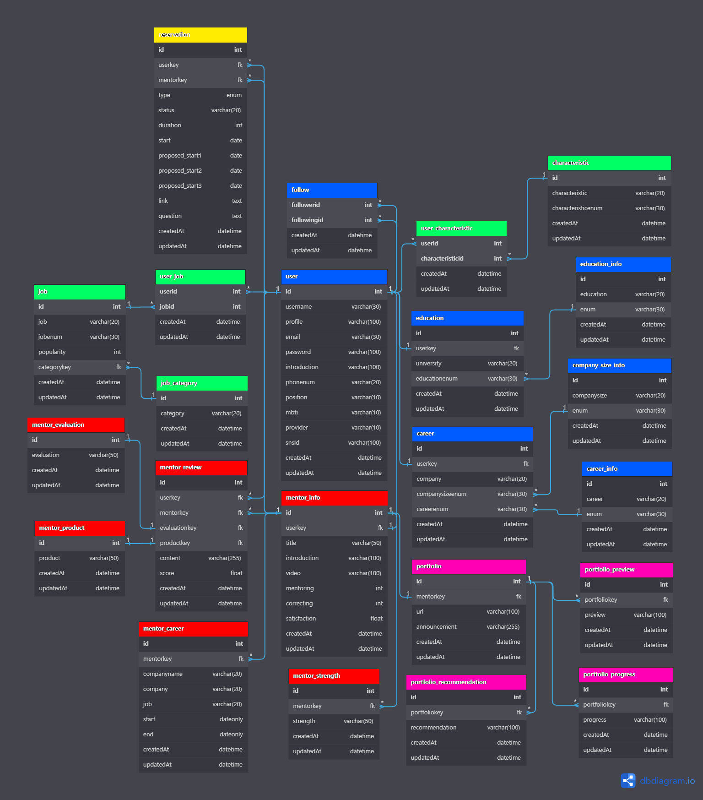

# RE:SPEC 메인 프로젝트

>**주제** : 취업에 성공한 우리 학교 선배 ● 내가 원하는 직군의 인생 선배를 만나 리:스펙 하는 플랫폼

- 자신이 궁금한 회사, 직무, 업계, 학교 사람(선배 & 멘토)과 자유로운 1:1 커리어 대화 연결 서비스
- 통합 로그인, 관련 커뮤니티, 멘토 추천, 사용자 기반 추천 서비스, 일정관리, 결제 시스템 etc

## 📚 Contents

- [Features](#-Features)
- [ToDo](#-ToDo)
- [Database ERD](#-Database-ERD)
- [Summary Notes](#-Summary-Notes)
- [Module](#-Dependency-Module)

## ⚙ Features

1. 멘토 찾기 부분 DB 설계 & 연동 (user, job, keyword, follow...) `계속 업데이트 예정`
2. 소셜 로그인 (카카오, 네이버, 구글, 로컬) & 로그아웃
3. 멘토 찾기 & 검색 API (키워드 & 필터)
4. 멘토 상세페이지 관련 데이터 GET API
5. 멘토 리뷰들 관련 데이터 GET API

## 📝 ToDo

1. 멘토 전환 API
2. 멘토 예약 기능

## ⛓ Database ERD


## 📓 Summary Notes
> Click the icons!

#### 협업 워크스페이션: [](https://quilt-tanker-16d.notion.site/RE-SPEC-1c8f389a7b924283a8c5401e07ff334a)
#### API 명세서: [](http://13.125.159.223:3000/api-docs/)

## 🛠 Dependency Module

```
  "dependencies": {
    "aws-sdk": "^2.1295.0",
    "bcrypt": "^5.1.0",
    "body-parser": "^1.20.1",
    "config": "^3.3.8",
    "cors": "^2.8.5",
    "express": "^4.18.2",
    "express-session": "^1.17.3",
    "express-validator": "^6.14.2",
    "morgan": "^1.10.0",
    "multer": "^1.4.5-lts.1",
    "multer-s3": "^2.10.0",
    "mysql": "^2.18.1",
    "mysql2": "^2.3.3",
    "passport": "^0.6.0",
    "passport-google-oauth": "^2.0.0",
    "passport-kakao": "^1.0.1",
    "passport-local": "^1.0.0",
    "passport-naver": "^1.0.6",
    "passport-naver-v2": "^2.0.8",
    "sequelize": "^6.25.7",
    "sequelize-cli": "^6.5.2",
    "winston": "^3.8.2",
    "winston-daily-rotate-file": "^4.7.1"
  },
  "devDependencies": {
    "eslint": "^8.27.0",
    "eslint-config-prettier": "^8.5.0",
    "eslint-plugin-prettier": "^4.2.1",
    "prettier": "^2.7.1",
    "standard-version": "^9.5.0",
    "swagger-autogen": "^2.22.0",
    "swagger-jsdoc": "^6.2.7",
    "swagger-ui-express": "^4.6.0"
  }
```
